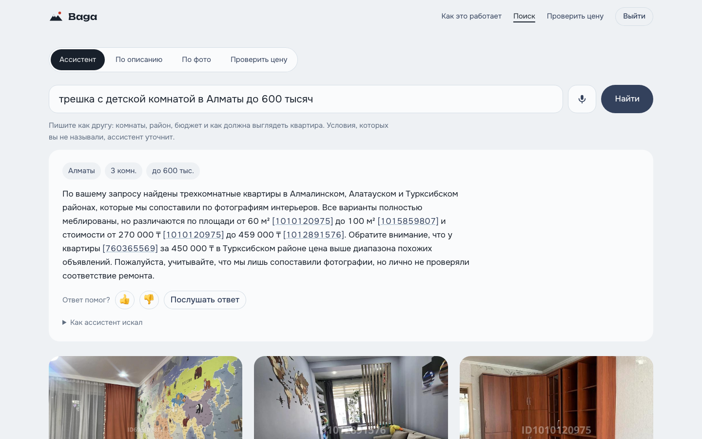
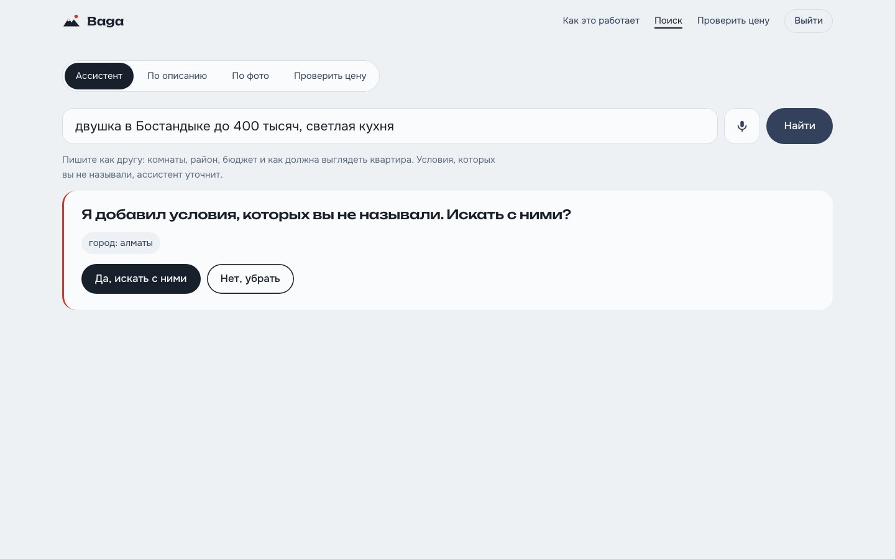
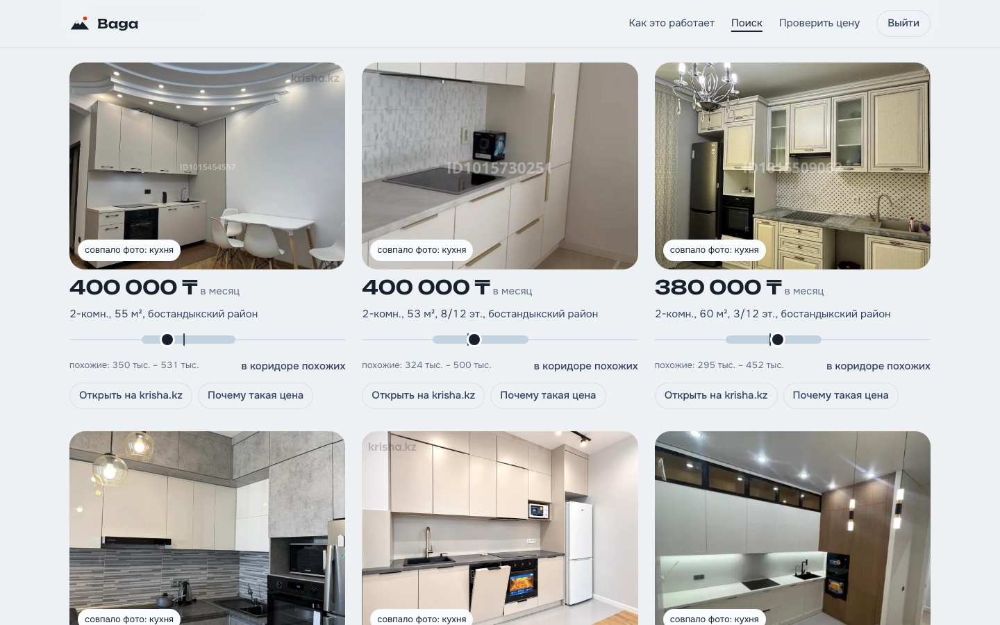
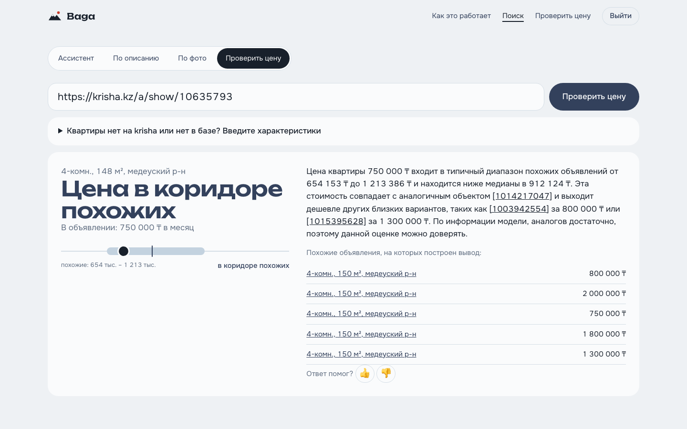
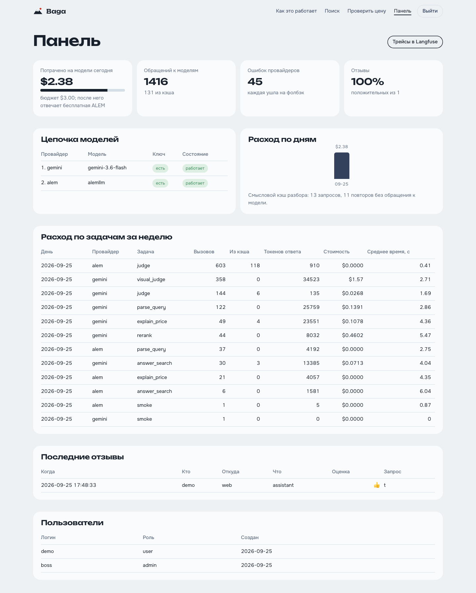
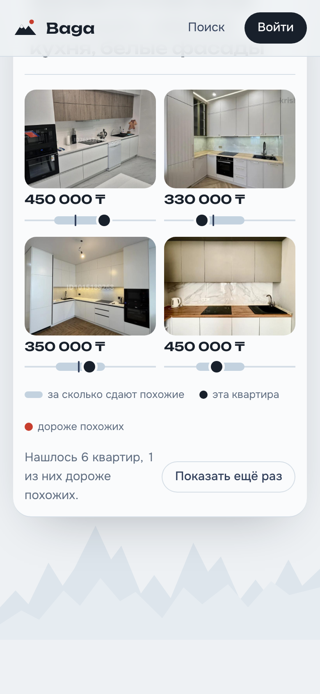

# Krisha · Baga AI — аренда квартир: поиск по ремонту и проверка цены

**Для кого.** Человек снимает квартиру в Алматы и листает сотни объявлений krisha.kz:
фильтры не умеют «светлая кухня, свежий ремонт», а по цене непонятно — это рынок или
завышено.

**Что делает продукт.** Находит квартиры по описанию ремонта (по фотографиям и текстам
объявлений) и по каждой говорит, дороже ли она похожих — с диапазоном и аналогами, которые
можно открыть и проверить. Текстом, голосом, на сайте, в Telegram и из любого MCP-клиента.

```
«двушка в Бостандыке до 400 тысяч, светлая кухня»
  → 6 объявлений, найденных по фото кухонь
  → у каждого: «в диапазоне похожих: 350–470 тыс., медиана 410» + аналоги [id]
```

## Как это выглядит


| Ассистент: разбор запроса и ответ со ссылками | Человек в контуре: модель додумала город — спрашиваем |
|---|---|
|  |  |
| **Найденные квартиры: фото кухонь и коридор цены** | **Проверка цены по ссылке krisha.kz** |
|  |  |
| **Панель админа: расход, модели, отзывы** | **Телефон** |
|  |  |

## Состав

| Папка | Что это |
|---|---|
| [`KrishaParser/`](KrishaParser) | парсер krisha.kz: списки и карточки (httpx + Playwright для динамики), фото с CDN, дедуп, SQLite |
| [`baga-ai/`](baga-ai) | продукт: RAG по фото и описаниям, модель цены, LangGraph-агент, MCP, сайт, бот |
| [`.github/workflows/ci.yml`](.github/workflows/ci.yml) | CI: парсер, офлайн-тесты, живые evals с порогом, сборка Docker |

## Запуск одной командой

```bash
cd baga-ai
cp .env.example .env      # ключи Gemini / ALEM / Langfuse — без них работает поиск и вердикт
docker compose up -d      # → http://localhost:8501
```

Подробно — [baga-ai/README.md](baga-ai/README.md). Архитектура и путь одного запроса —
[baga-ai/ARCHITECTURE.md](baga-ai/ARCHITECTURE.md). Метрики и A/B — [baga-ai/EVALS.md](baga-ai/EVALS.md).

## Соответствие требованиям

| Требование | Где | Чем подтверждено |
|---|---|---|
| LangGraph, ветвления, цикл, человек в контуре | `baga-ai/agent.py` | подтверждение домысленных условий (`interrupt`), цикл ослабления фильтров, кнопки на сайте и в Telegram |
| Свой MCP-сервер, 2–3+ инструмента | `baga-ai/mcp_server.py` | 4 инструмента, тест через MCP-клиента в CI |
| Свой Skill | `baga-ai/skills/rent-price-check/SKILL.md` | триггеры, «когда не использовать», скрипт |
| RAG: chunking, эмбеддинги, векторная БД, слияние | `search.py`, `qdrant_store.py`, `text_embed.py` | SigLIP 2 (фото), ALEM text-1024 (описания), Qdrant, RRF; обоснование «без chunking» в ARCHITECTURE |
| Скрапинг с динамическим контентом | `KrishaParser/` | httpx + Playwright, 7 485 объявлений, 72 963 фото |
| Мультимодальность | `embed.py`, `rooms.py`, `voice.py` | поиск текстом по фото, поиск по своему фото, тип комнаты zero-shot, детектор рендеров, дубли по DINOv3, голос |
| Трейсинг всех LLM-вызовов | `tracing.py`, `llm.py` | Langfuse: трейс на запрос, узлы графа, токены, цена, 👍/👎 |
| Golden dataset ≥ 30, 2+ метрики | `evals.py`, `ab_models.py` | 32 запроса поиска (precision@5, LLM-судья), 36 запросов разбора (5 метрик) |
| A/B эксперимент | `ab_models.py`, `ab_generation.py`, `evals.py` | ALEM против Gemini, thinking, temperature/top_p/max_tokens, каналы, язык запроса |
| Выбор LLM и гиперпараметров с обоснованием | ARCHITECTURE «Выбор моделей», EVALS 3 и 6 | цена, латентность и качество в одной таблице |
| Веб-фронтенд | `baga-ai/server.py`, `baga-ai/web/` | FastAPI + собственный фронтенд: главная с живым демо, ассистент, поиск по описанию и по фото, проверка цены, вход, панель админа |
| **Рекомендуемые** | | |
| Guardrails | `guardrails.py` | инъекции (recall 95%), PII, домен, сверка сумм и id на выходе |
| Кэширование | `llm.py`, `semantic_cache.py` | точный кэш ответов + смысловой кэш разбора с порогом из эксперимента |
| Фолбэк между моделями | `llm.py` | Gemini → ALEM → шаблон; предохранитель; дневной бюджет |
| Docker + compose | `baga-ai/Dockerfile`, `docker-compose.yml` | Qdrant + init + сайт + бот |
| CI/CD с evals на каждый PR | `.github/workflows/ci.yml` | порог качества разбора роняет сборку |
| Аутентификация и роли | `auth.py` | guest / user / admin, PBKDF2, лимит частоты |
| Голосовой интерфейс | `voice.py` | речь → агент → речь, на сайте и в Telegram |
| Fine-tuning / LoRA | `finetune_text_lora.py` | LoRA на текстовую башню SigLIP 2, оценка на отложенном фолде |
| Свой eval-фреймворк, нестандартные метрики | `ab_models.py`, `guardrails.check_output` | «выдуманные суммы / id», «ловушки», «покрытие» |
| Интеграция с внешним API | `telegram_bot.py` | Telegram Bot API |
| Реальные пользователи и обратная связь | `store.py`, админ-панель | 👍/👎 на сайте и в боте → SQLite + score в Langfuse |
