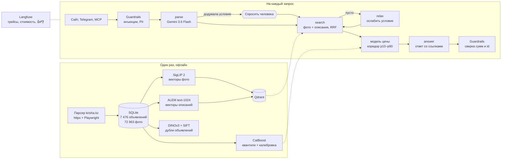

# Baga — аренда в Алматы по виду ремонта и с честной ценой

Мы — Исламбек Султанбек и Нурдаулет. Это наш финальный проект курса nFactorial:
сервис, который ищет квартиры в аренду по тому, **как они выглядят**, и говорит, **дороже ли
квартира похожих**. Всё — от парсера krisha.kz до сайта, Telegram-бота и оценки качества —
мы сделали вдвоём.


## Какую проблему мы решаем

Поиск квартиры в аренду сейчас выглядит так: на krisha.kz ставишь фильтры «2 комнаты,
Бостандыкский район, до 400 тысяч» — и листаешь сотни объявлений, потому что фильтра
«светлая кухня» или «свежий ремонт без ковров» не существует. А когда нужная квартира всё же
находится, непонятно, нормальная ли это цена или хозяин просит на сотню тысяч больше рынка.

**Для кого:** человек 20–35 лет, который снимает квартиру в Алматы, ищет с телефона и
знает, какой ремонт хочет, но не знает рынок.

**Как он решает это сейчас:** часами листает фото, сравнивает цены в голове и спрашивает
знакомых «а это нормально за такие деньги?».

**Что даём мы:**

- пишешь как другу — «двушка в Бостандыке до 400 тысяч, светлая кухня» — или говоришь
  голосом, а мы ищем по 73 тысячам фотографий: кухни среди кухонь, спальни среди спален;
- у каждой квартиры — коридор цены: за сколько сдаются 80% похожих объявлений, и где в нём
  эта квартира;
- любое объяснение ссылается на конкретные объявления, которые можно открыть и проверить;
- можно прислать свою фотографию интерьера или ссылку на объявление krisha.

## Где попробовать

| Канал | Как |
|---|---|
| Telegram-бот | [@krishaa_ai_bot](https://t.me/krishaa_ai_bot) — текст, голосовые, ссылки на krisha.kz |
| Сайт | `docker compose up -d` → http://localhost:8501 (инструкция ниже); публичная ссылка — [deploy/HUGGINGFACE.md](baga-ai/deploy/HUGGINGFACE.md) |
| Claude, Cursor | MCP-сервер: `claude mcp add baga-ai -- python baga-ai/mcp_server.py` |

## Как это выглядит

| Ассистент: разобрал запрос и ответил со ссылками | Человек в контуре: модель додумала город — спрашиваем |
|---|---|
|  |  |
| **Найденные квартиры: фото кухонь и коридор цены** | **Проверка цены по ссылке krisha.kz** |
|  |  |
| **Панель админа: расход на модели, провайдеры, отзывы** | **Телефон** |
|  |  |

## Как это устроено



Агент — граф LangGraph: `parse → confirm? → search ⇄ relax → answer`. Ветвление — вопрос
человеку только тогда, когда модель добавила условие, которого не было в запросе; цикл —
ослабление фильтров, если ничего не нашлось; пауза — `interrupt()` с кнопками на сайте и в
Telegram. Все вызовы моделей идут через наш шлюз: Gemini 3.6 Flash → ALEM → шаблонный ответ из
фактов, с кэшем, дневным бюджетом и предохранителем.

Путь одного запроса по шагам, все компоненты и почему выбраны именно они —
[baga-ai/ARCHITECTURE.md](baga-ai/ARCHITECTURE.md).

## Почему именно так

- **LangGraph, а не CrewAI.** Шаги у нас детерминированные, нужны условные переходы, цикл и
  остановка на человеке — а не команда агентов, которые договариваются. `interrupt()` и
  чекпоинтер дают паузу из коробки.
- **Gemini 3.6 Flash основной, ALEM запасной.** Мы сравнили их на четырёх задачах. На разборе
  запроса Gemini не ошиблась ни разу из 36, ALEM — в 8 случаях и в 25% ловушек придумывала
  условия («хочу жить у гор» → районы Медеу и Бостандык). Запрос стоит около $0.0024.
  ALEM бесплатная, поэтому осталась фолбэком и судьёй в оценках — там она не хуже.
- **Поиск по фото, а не только по тексту.** В описаниях объявлений стиль ремонта почти не
  упоминается: там цена, район и «хозяин адекватный». Поэтому SigLIP 2 — модель, которая
  кладёт текст и картинки в одно пространство и понимает русский.
- **Chunking не делаем.** Единица поиска — объявление, медианное описание 508 символов
  короче окна модели. Резать нечего — это решение, а не пропуск.
- **Коридор цены, а не одна цифра.** Квантильная регрессия и конформная калибровка:
  голая модель давала покрытие 66% вместо 80%, и каждая третья нормальная квартира
  выглядела бы завышенной.
- **Свой MCP-сервер.** Потребитель — языковая модель в Claude или Cursor: ей нужны описанные
  инструменты, которые она выбирает сама по ходу разговора, а не REST-эндпоинты.

## Как мы проверяли качество

| Что | Результат |
|---|---|
| Поиск: визуальный судья (Gemini смотрит на фото топ-5), 32 запроса | нужное видно на фото в **82%** найденных квартир |
| Поиск: автоматическая разметка по описаниям, 12 запросов | precision@5 **35–37%** против 7.7% у случайного выбора |
| Разбор запроса: 36 размеченных запросов, 8 ловушек | **100%** точных, 0 выдуманных условий |
| Модель цены: out-of-fold на 7 476 объявлениях | ошибка **16.4%** против 22.3% у рыночного правила «медиана за метр по району» |
| Объяснения: выдуманные суммы и id | **0** — выходной фильтр сверяет каждое число с фактами |
| Guardrails: 20 атак и 64 обычных запроса | ловит 95% инъекций, 0 ложных блокировок |
| Время ответа ассистента | медиана **6.2 с**, максимум 8.1 с |

A/B-эксперименты: ALEM против Gemini, уровень рассуждений Gemini, temperature, top_p,
max_tokens, каналы поиска и их веса, язык запроса, порог смыслового кэша.
Все таблицы и выводы — в [baga-ai/EVALS.md](baga-ai/EVALS.md). Живые оценки запускаются в
CI на каждый PR: если разбор запроса станет хуже 90%, сборка падает.

**Гипотезы, которые не подтвердились.** Мы дообучили текстовую часть SigLIP (LoRA) на парах
«описание → фото» — прирост 3 п.п. оказался в пределах шума: описания почти не говорят о
том, что видно на фото. Мультимодальный реранкер на Gemini по независимой метрике дал +1.7
п.п. при вчетверо большей цене запроса — выключили. А слияние каналов поиска с равными
весами, которое мы считали правильным, на деле портило выдачу: 59% вместо 82%. Всё это
найдено измерениями и описано в EVALS.md.

## Запуск

Одной командой (нужен Docker):

```bash
git clone https://github.com/Damenzzzz/Krisha_baga_predictor && cd Krisha_baga_predictor/baga-ai
cp .env.example .env          # ключи Gemini, ALEM, Langfuse; без них работают поиск и вердикт по цене
docker compose up -d          # Qdrant + загрузка индекса + сайт → http://localhost:8501
docker compose --profile telegram up -d    # ещё и бот (нужен TELEGRAM_BOT_TOKEN)
```

Без Docker, Python 3.12:

```bash
cd baga-ai && pip install -r requirements.txt
python qdrant_store.py ensure           # векторы в Qdrant, один раз (~1 минута)
uvicorn server:app --port 8501          # сайт
python telegram_bot.py                  # бот
python auth.py add admin --role admin   # первый админ
pytest tests                            # 50 тестов, то же, что в CI
```

Парсер собирается отдельно: [KrishaParser/README.md](KrishaParser/README.md).

## Соответствие заданию

| Требование | Где | Чем подтверждено |
|---|---|---|
| LangGraph с ветвлением, циклом и человеком в контуре | `baga-ai/agent.py` | вопрос о домысленных условиях, цикл ослабления фильтров, кнопки на сайте и в Telegram |
| Свой MCP-сервер, 2–3+ инструмента | `baga-ai/mcp_server.py` | 4 инструмента, тест через MCP-клиента в CI |
| Свой Skill | `baga-ai/skills/rent-price-check/SKILL.md` | триггеры, «когда не использовать», скрипт |
| RAG: chunking, эмбеддинги, векторная БД, reranker | `search.py`, `qdrant_store.py`, `rerank.py` | SigLIP 2 + ALEM text-1024, Qdrant, RRF с подобранным весом; реранкер проверен и выключен по данным |
| Скрапинг с динамическим контентом | `KrishaParser/` | httpx для списков, Playwright для карточек, 7 485 объявлений, 72 963 фото |
| Мультимодальность | `embed.py`, `rooms.py`, `voice.py`, `eval_visual_judge.py` | поиск текстом по фото, поиск по своему фото, тип комнаты, детектор рендеров, дубли по DINOv3, голос, визуальный судья |
| Трейсинг всех вызовов LLM | `tracing.py`, `llm.py` | Langfuse: трейс на запрос, узлы графа, токены, стоимость, 👍/👎 |
| Golden dataset ≥ 30, 2+ метрики | `evals.py`, `ab_models.py` | 32 запроса поиска, 36 запросов разбора; 7 метрик |
| A/B эксперимент | `ab_models.py`, `ab_generation.py`, `evals.py` | 8 экспериментов с выводами |
| Выбор LLM и гиперпараметров | ARCHITECTURE «Выбор моделей», EVALS 3 и 6 | цена, скорость и качество в одной таблице; temperature, top_p, max_tokens, thinking |
| Веб-фронтенд | `baga-ai/server.py`, `baga-ai/web/` | главная с живым демо, поиск в 4 режимах, вход, панель админа |
| **Рекомендуемое** | | |
| Guardrails | `guardrails.py` | инъекции, PII, домен на входе; сверка сумм и id на выходе |
| Кэширование | `llm.py`, `semantic_cache.py` | точный кэш ответов и смысловой кэш разбора с порогом из эксперимента |
| Фолбэк между моделями | `llm.py` | Gemini → ALEM → шаблон, предохранитель, дневной бюджет |
| Docker и docker-compose | `baga-ai/Dockerfile`, `docker-compose.yml` | Qdrant + загрузка индекса + сайт + бот |
| CI/CD с evals на каждый PR | `.github/workflows/ci.yml` | 4 задачи, порог качества роняет сборку |
| Аутентификация и роли | `auth.py`, `server.py` | гость, пользователь, админ; лимиты по ролям |
| Голосовой интерфейс | `voice.py` | речь → агент → речь, на сайте и в Telegram |
| Fine-tuning / LoRA | `finetune_text_lora.py` | LoRA на SigLIP 2, оценка на отложенных объявлениях |
| Свой eval-фреймворк, нестандартные метрики | `ab_models.py`, `eval_visual_judge.py` | «ловушки», «выдуманные суммы и id», «покрытие», визуальный судья |
| Интеграция с внешним API | `telegram_bot.py` | Telegram Bot API |
| Реальные пользователи и обратная связь | `store.py`, панель админа | 👍/👎 на сайте и в боте → SQLite и оценки в Langfuse |
| Деплой на публичный URL | `deploy/HUGGINGFACE.md`, `start.sh` | образ готов к Hugging Face Spaces |

## Ограничения

- Мы знаем цены **объявлений**, а не сделок, поэтому говорим «дороже похожих», а не «вы
  переплачиваете». Если завышен весь рынок, модель этого не увидит.
- Данные — один срез от 21 сентября 2026: динамики цен пока нет.
- Каскелен — 3.5% объявлений, там оценка заметно менее точная (ошибка 22.7% против 16.1%).
- Геозапросов вроде «рядом со школой» нет: координаты есть только у 41% объявлений.

## Что в репозитории

| Папка | Что это |
|---|---|
| [`KrishaParser/`](KrishaParser) | парсер krisha.kz: списки и карточки, фото с CDN, дедуп, SQLite |
| [`baga-ai/`](baga-ai) | продукт: поиск, модель цены, агент, шлюз LLM, MCP, сайт, бот, оценки — [подробно](baga-ai/README.md) |
| [`.github/workflows/ci.yml`](.github/workflows/ci.yml) | CI: парсер, тесты, живые оценки с порогом, сборка Docker |
